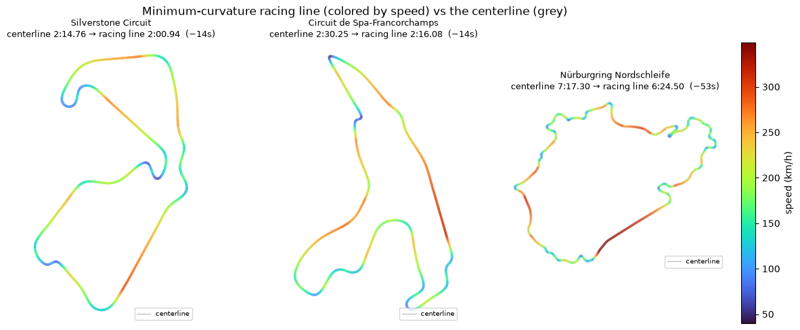
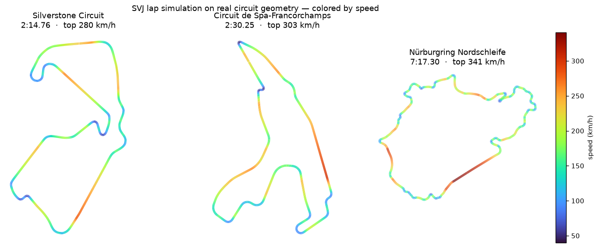
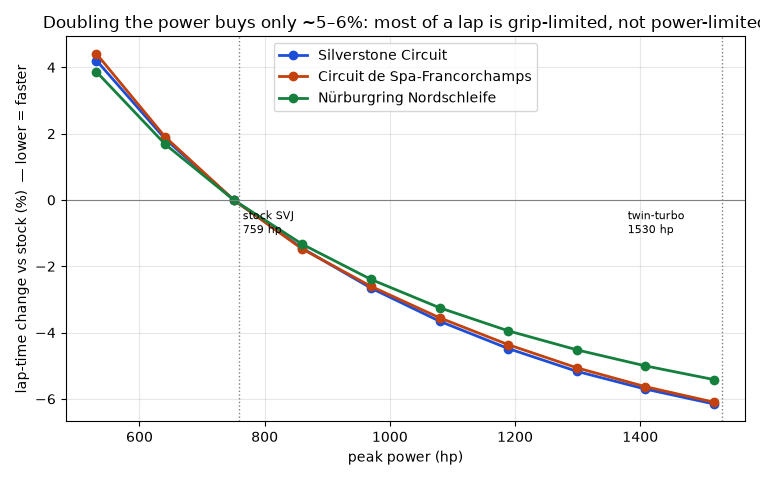
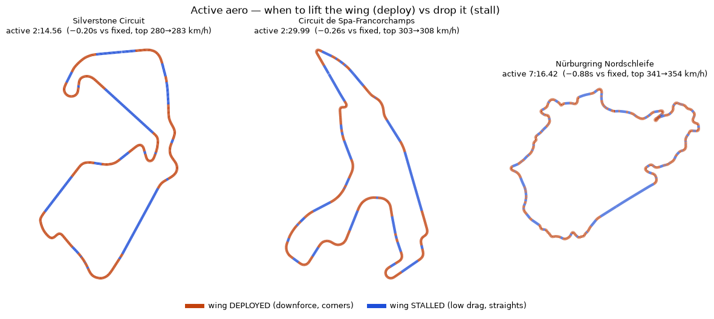
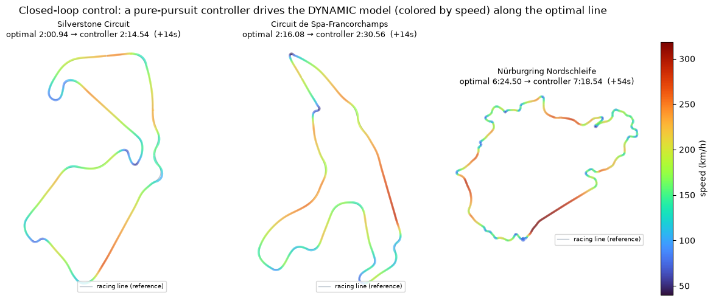
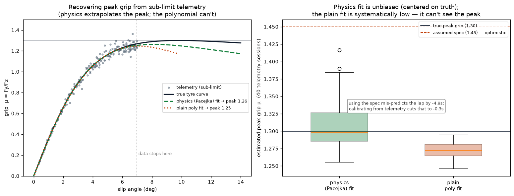

# From a dyno pull to a Nürburgring lap

[](https://github.com/raahimnawaz/engine-map-pinn/actions/workflows/ci.yml)
[](LICENSE)
[](https://www.python.org/)

A physics pipeline that takes an engine's dyno curve and predicts how the car
laps a real racetrack — engine map → vehicle dynamics → lap-time simulation —
on real geometry for **Silverstone, Spa, and the Nürburgring Nordschleife**.
The car modeled is the **Lamborghini Aventador SVJ**.

> **Why I built this.** I kept seeing the racing-line and telemetry overlays in
> Forza — the glowing line through a corner, the speed readout — and wanted to
> know what's actually *under* it: how do you compute the fastest line, and how
> much does the engine even matter versus the tyres? So I built the real physics
> behind that overlay, from the dyno curve all the way to a lap time.



## The headline results

The SVJ on three real circuits, simulated from the engine curve up:

| Circuit | Length | Lap (centerline) | Lap (racing line) | Top speed |
|---|---|---|---|---|
| **Silverstone** | 5.88 km | 2:14.8 | **2:00.9** | 280 km/h |
| **Spa-Francorchamps** | 6.99 km | 2:30.3 | **2:16.1** | 303 km/h |
| **Nürburgring Nordschleife** | 20.77 km | 7:17.3 | **6:24.5** | 341 km/h |



**Honest validation — the model brackets reality.** The SVJ's real Nordschleife
record is **6:44.97**. My two estimates straddle it: the *centerline* lap (7:17)
is too slow because the centerline isn't the fast way round, and the
*minimum-curvature racing line* (6:24) is a touch too fast because it over-flattens
corners under a constant-width assumption and optimizes curvature, not time. The
truth sits between them — which is about the best a first-order quasi-steady-state
sim should claim. I'd rather show that honestly than tune a knob to hit 6:44.

## Two findings worth the build

**1. More power barely helps.** Doubling the engine — the stock 759 hp SVJ to a
1530 hp twin-turbo build — makes it only **5–6% faster** on every track, because
most of a lap is **grip-limited, not power-limited** (the Nordschleife is ~50%
grip-limited). The tyres, not the engine, are usually the bottleneck.



**2. The racing line is worth far more than the engine.** Re-optimizing the
*path* (minimum-curvature line within the track width) saves 14 s at Silverstone
and ~53 s on the Nordschleife — an order of magnitude more than doubling the
power. Where you point the car beats how much power it has.

**3. Active aero — lift the wing in corners, drop it on straights.** Modeling
the SVJ's ALA system (deploy downforce when grip-limited or braking, stall the
wing for low drag on power-limited straights) beats either fixed setup, and adds
top speed where it matters (Nordschleife 341 → **354 km/h** down Döttinger Höhe).
The control logic falls straight out of the grip/power limit classification.



## How it works — three stages, and where the ML actually is

```
sparse dyno pulls ─[PINN: reconstruct]→ engine map ─[lap sim: physics]→ lap time ─[optimize: search]→ faster lap
```

- **Stage 1 — engine map (a PINN).** A few noisy dyno sweeps don't cover the
  whole operating range; a physics-informed network reconstructs the full
  torque/power/fuel map from them (power = torque·ω and affine-in-load are baked
  in as residuals). It's a *reconstructor*, not an optimizer — it cleans the dyno
  data into a usable map. **Honest note:** I tested whether the physics prior
  actually helps and it only does when data is genuinely sparse — with a normal
  amount of logged data a plain network is just as good (`figures/when_physics_helps.png`).
- **Stage 2 — lap simulation (physics, not ML).** A quasi-steady-state solver:
  corner-speed limits from the friction circle, a forward pass limited by the
  engine map and traction, a backward braking pass, integrated around the real
  circuit geometry. This is the standard motorsport tool.
- **Stage 3 — optimization (the "go faster" part).** Wrap a search around the
  sim and it finds faster setups: the minimum-curvature racing line above, a
  per-track final-drive optimization (`figures/optimize_gearing.png`), and the
  active-aero schedule.
- **Stage 4 — control (closed loop on a dynamic model).** The QSS racing line is
  the *optimal reference*; a controller then has to actually *drive* it on a model
  with real dynamics. `dynamics.py` is a dynamic bicycle model with Pacejka tyres
  (validated — its steady-state cornering radius matches the Ackermann estimate),
  and a **pure-pursuit + speed controller drives it around all three circuits in
  closed loop**, tracking the racing line to ~2 m and lapping **within ~10–13% of
  the QSS optimal** — scored against the QSS lap as the baseline. That gap is the
  honest cost of real dynamics (tyre slip, yaw) and a tracking controller vs the
  theoretical point-mass optimum.



  An MPCC (model-predictive contouring controller, `mpcc.py`, CasADi/IPOPT) is
  also scaffolded as the more ambitious controller — formulation and harness run,
  but robust full-lap convergence needs solver tuning (acados, Frenet
  reformulation), so the **pure-pursuit controller above is the working result**
  and the MPCC is honestly labeled a scaffold.

This is also where the **vehicle-dynamics repo** plugs in: its estimator fits
the Pacejka tyre / friction / drag parameters from real telemetry, calibrating
exactly the dynamic model the controller drives.

### Calibrating grip from telemetry (the PINN-B role)



Lap time is set by the tyre's **peak** grip, but a driver mostly stays *below*
the limit, so the telemetry (lateral-g vs slip angle) rarely samples the peak —
recovering it needs the tyre *physics*. A grey-box **Pacejka fit extrapolates
the grip peak** from sub-limit data and is **unbiased** (centered on the true
peak across runs); a physics-free polynomial is **systematically low** because it
can't see past the data. This is exactly the role **PINN-B** plays in the
vehicle-dynamics repo, and the same lesson as the engine-map PINN: physics
structure buys you the extrapolation. Feeding the calibrated grip back into the
lap sim matters — assuming the published μ here mis-predicts the lap by **~5 s**,
and calibrating from telemetry cuts that to **~0.3 s** (`enginemap/tire_id.py`).

The engine map validates against the SVJ's real published peaks (759 hp / 531
lb-ft); details and the map/BSFC figures are in [`docs/engine_map.md`](docs/engine_map.md).

## Data provenance (it's real geometry)

- **Silverstone, Spa** — centerlines from the [f1-circuits](https://github.com/bacinger/f1-circuits) dataset.
- **Nordschleife** — stitched from OpenStreetMap `highway=raceway` ways into a
  single 20.77 km loop (matches the real 20.8 km).
- **Engine** — a mean-value V12 calibrated to the SVJ's published figures (no
  proprietary dyno data exists publicly; the twin-turbo variant is a plausible
  *what-if*, not a measurement).

## Honest scope

Quasi-steady-state, point-mass; constant track width; the engine map is
simulated, not a real dyno log. So **absolute** lap times are approximate (hence
the bracket around the real record). The **relative** results — track vs track,
power vs grip, centerline vs racing line — are the trustworthy part, and the
telemetry path (`enginemap/telemetry.py`, simulated now, real OBD-II later)
replaces simulated inputs with measured ones.

On the **racing line**: the default is minimum-*curvature* (a fast, cheap
proxy). `raceline.optimize_min_time` optimizes the line offsets directly against
the lap simulator's lap *time* instead — and on Silverstone it finds only
~0.03 s over the curvature line, confirming the proxy is near-optimal here. (It
would matter more on a circuit dominated by a slow corner feeding a long
straight, where you'd trade corner speed for exit speed; it's also ~100× slower,
so it's opt-in, not the default.)

## Reproduce

```bash
uv venv --python 3.12 && uv pip install -e ".[dev]"
PYTHONPATH=src python scripts/make_laps.py        # lap sim + speed maps + power sweep
PYTHONPATH=src python scripts/make_raceline.py    # racing-line optimization
PYTHONPATH=src python scripts/make_aero.py        # active-aero deploy schedule
PYTHONPATH=src python scripts/make_control.py     # closed-loop control vs QSS optimal
PYTHONPATH=src python scripts/make_tire_calibration.py # tyre-grip ID from telemetry
PYTHONPATH=src python scripts/optimize_gearing.py # setup optimization
PYTHONPATH=src python scripts/make_figures.py     # engine map + the PINN study
uv pip install -e ".[control]"                    # MPCC scaffold needs casadi
uv run pytest -q
```

## Layout

```
src/enginemap/
  engine.py     first-principles V12, calibrated to the SVJ
  pinn.py       physics-informed engine-map surrogate (+ the honesty study)
  track.py      load real circuit geometry -> curvature profile
  vehicle.py    SVJ vehicle model: engine map -> tractive force through the gearbox
  lapsim.py     quasi-steady-state lap-time solver (+ active-aero schedule)
  raceline.py   minimum-curvature racing-line optimizer
  dynamics.py   dynamic bicycle model + Pacejka tyres
  controller.py pure-pursuit closed-loop controller (the working one)
  mpcc.py       model-predictive contouring controller (scaffold)
  tire_id.py    grey-box Pacejka grip identification from telemetry (PINN-B role)
  telemetry.py  OBD-II telemetry source (simulated now, real adapter later)
data/tracks/    real Silverstone / Spa / Nordschleife geometry
scripts/        reproduce every figure
```

## License

MIT.
