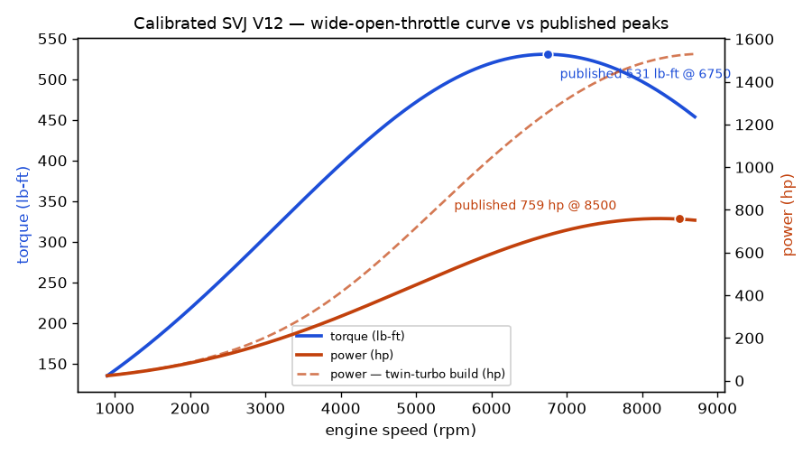
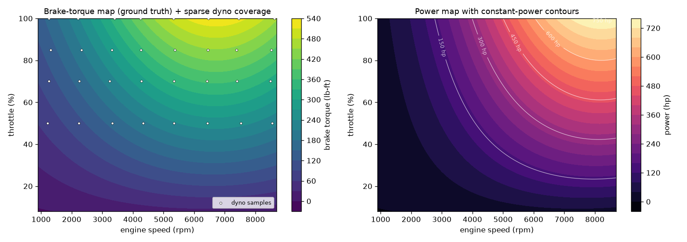
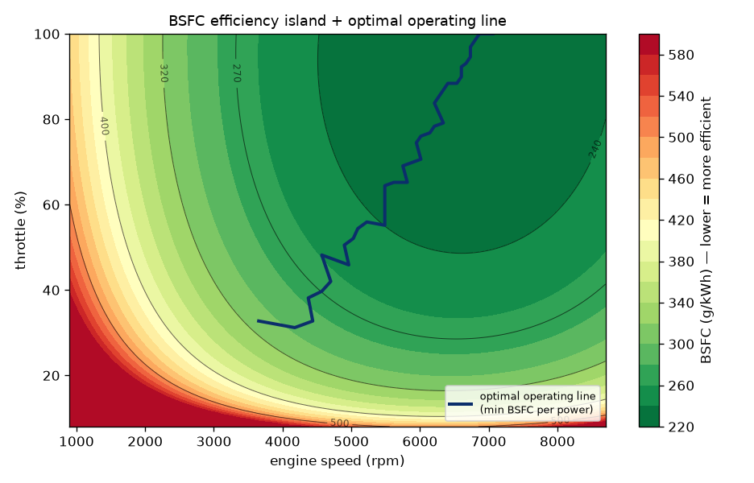
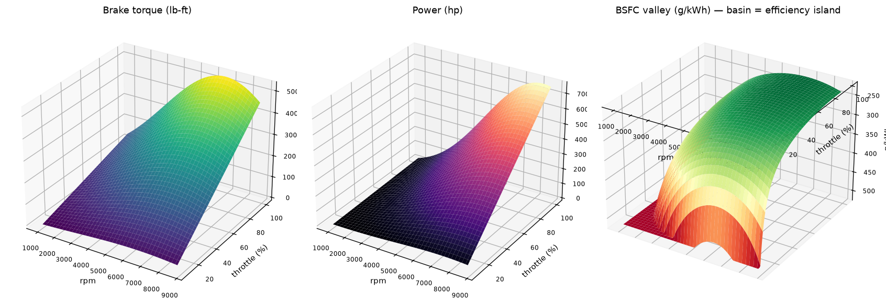
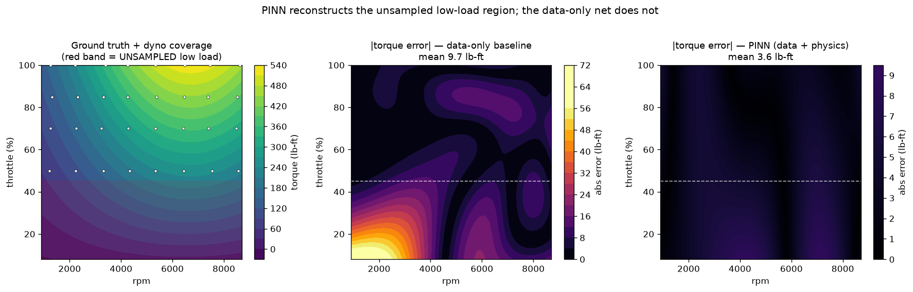
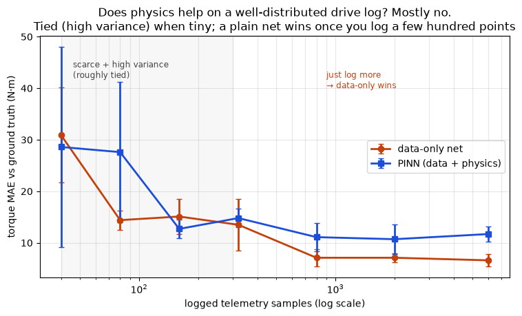

# Stage 1 — the engine map (a physics-informed surrogate)

The lap simulator needs a complete engine map. A real dyno session only produces
a few sparse, noisy sweeps, so a physics-informed neural network reconstructs
the full torque / power / fuel surface from them.

## Calibrated to the real SVJ

The mean-value V12 model is auto-calibrated to the Aventador SVJ's published
figures, and reproduces them:

| Quantity | Published | Model |
|---|---|---|
| Peak power | 759 hp @ 8500 rpm | **759 hp** @ ~8240 rpm |
| Peak torque | 531 lb-ft @ 6750 rpm | **531 lb-ft** @ ~6720 rpm |
| Best BSFC | (perf NA gasoline ≈ 220–250) | **~223 g/kWh** |

## How the PINN works

Inputs `(rpm, throttle)` → `(brake torque, fuel rate)`. Brake power is the exact
identity `P = τ·ω`, so it's derived, not a free output. A residual loss enforces
the engine's structure on collocation points: torque affine in load
(`∂²τ/∂throttle² ≈ 0`), load monotonicity, fuel affine in load, and brake power
≤ fuel power. On sparse dyno data this reconstructs the unsampled regions where a
data-only net fails:

## The honest caveat — when does the physics help?

I tested the premise instead of asserting it. With **sparse** data and a
structured gap (a few dyno pulls), the physics prior clearly wins. With a
**realistic amount** of logged telemetry, a plain network matches or beats it —
the physics only matters when data is scarce:

That's the honest read: the PINN is the right tool for sparse dyno reconstruction
and physical guarantees, not a default that beats a black box at all data sizes.
